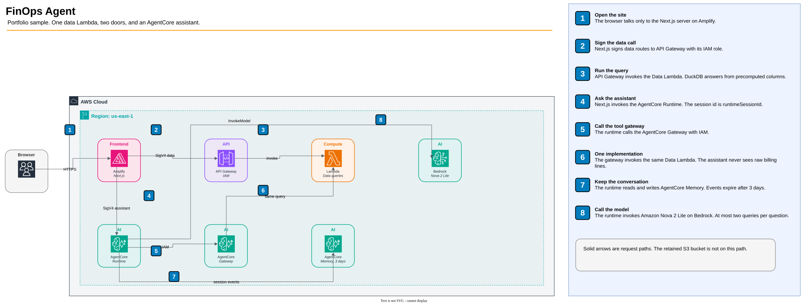

# FinOps Agent

Have you ever wondered how much you could save by optimizing your AWS spend? What if...?

[In this product](https://main.d1e2bsg3elvnb4.amplifyapp.com/explore) a user can see exactly how much a cloud commitment would save, take that number apart by service, account, or region, and **ask a plain-language question about the same figure**. 

The system is fully serverless and AWS-native following AWS AIP C01 patterns for best practices. The agent runs on Amazon Bedrock AgentCore, AWS's platform for scalable agents: a runtime, a tool gateway, and short-term memory. The site, the API, and the data service are Lambda, API Gateway, and Amplify. There is no server to keep running, no database to patch, and no idle container fleet. You pay for requests. A month with no traffic stays small.

Every resource is code, in two IaC CDK stacks. Stateful pieces (the data bucket and agent memory) are separate from compute, so a redeploy replaces the application without leaving orphaned infrastructure behind, and `make destroy` removes what the template created. IAM is written out action by action. 

## Try it

Hosted app: `https://main.d1e2bsg3elvnb4.amplifyapp.com/`

The stack output `AmplifyDefaultDomain` is `d1e2bsg3elvnb4.amplifyapp.com`. Amplify serves the production branch at the URL above once the build from `main` finishes.

## Architecture



The browser talks only to the Next.js server. That server signs two kinds of calls with its own IAM role. Data routes go to API Gateway, which invokes one Lambda. DuckDB answers from precomputed columnar data. Assistant routes invoke the AgentCore Runtime, which calls Amazon Nova 2 Lite on Bedrock and may run at most two queries. The runtime calls that same Lambda through the AgentCore Gateway, so there is one query implementation and two front doors. Memory keeps a short conversation for the session and expires after three days. A retained S3 bucket is not on this path.

Hosted sessions are on the console page GenAI Observability, Bedrock AgentCore, Sessions. `make dev-agent` is a process on your laptop. It does not write those logs, and it does not appear on that page.

## Quickstart

You need Docker, [uv](https://docs.astral.sh/uv/), and bun or npm. The agent also needs an AWS profile with Amazon Nova 2 Lite enabled in Bedrock. Billing parquet is not in git. Precompute once so the data service has a dataset.

```bash
make install
make precompute-db
```

Two terminals:

```bash
make dev-api        # Data API. Port is LOCAL_API_PORT from .env
make dev-frontend   # Next.js on 3000, pointed at that API
```

Open `http://localhost:3000`. The home page is the savings figure. Explore slices spend. The commitment view recomputes the split. The assistant needs the agent process:

```bash
make dev-agent
make ask Q="What are the top services by on-demand spend?"
```

Deploy when you want the hosted app. Put `GITHUB_TOKEN_SECRET_ARN` in the repo-root `.env` and run `make deploy`. Maintainer notes, the API contract, and the frontend integration checklist are in `docs/PRD.md`.

## Where the code lives

| Folder | What it is |
|---|---|
| `src/finops_agent/data` | The query service. DuckDB, commitment math, the Lambda image. |
| `src/finops_agent/ai` | The Strands agent on AgentCore. It plans at most two queries. |
| `src/finops_agent/frontend` | The Next.js app on Amplify. |
| `app.py` | CDK entry. Stacks only. |
